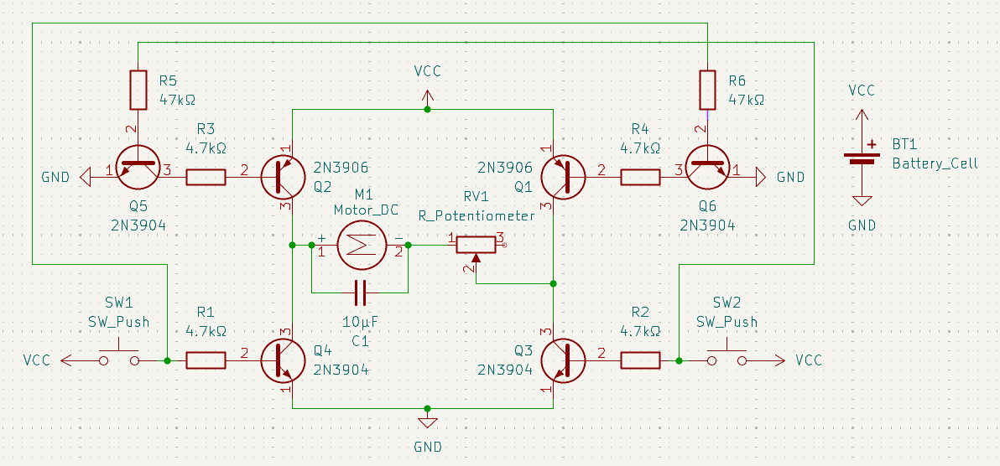
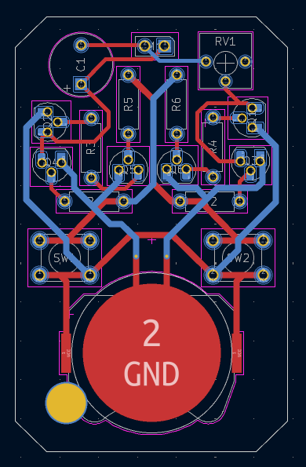
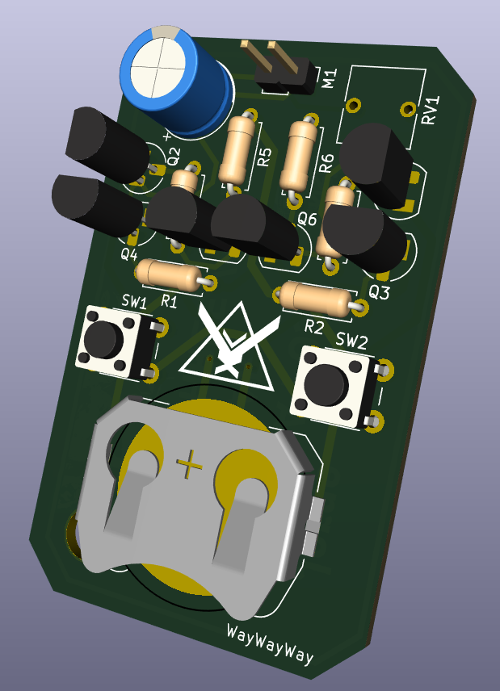
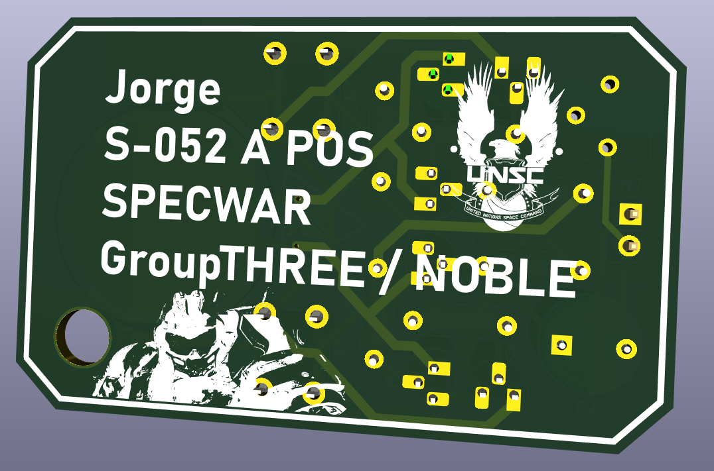

# pcb-be-like
So this is a really sketchy h-bridge circuit that is capable of running the vibration motor in 2 different directions with 2 different button presses. Yeah, it's kind of useless when it's hooked up to a vibration motor and not an actual motor, but like I wanted to mess around with transistors and I lowk didn't know what else I could make that wasn't too simple nor too complex for me. 

## Schematic

## PCB
I hid the silkscreens over here because it got really cluttered but the silksceens are on the next images 
  

Since the least amount of pcbs I can buy is 5, I wanted to do something with the extras, and so I thought of making the back silkscreen layer some kind of dog tags of Jorge from halo reach. 
 

## BOM
* 1x battery holder
* 2x push buttons
* 4x 4.7kΩ resistors
* 2x 47kΩ resistors
* 4x NPN transistors
* 2x PNP transistors
* 1x 10μF capacitor
* 1x potentiometer
* 1x vibration motor

made by `@anaykshatriya` on slack
